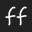

#  Form Factory

Form Factory is an innovative platform designed to streamline the process of creating and managing forms. By leveraging a user-friendly drag-and-drop interface, Form Factory empowers users to design dynamic forms effortlessly without needing technical expertise. From simple contact forms to complex multi-step workflows, Form Factory offers a robust solution for all form-building needs.


## Tech stack

- NextJS 15
- React 19
- Tailwind Css
- ShadCN
- MagicUI
- Aceternity

## Setup

```bash
git clone <url>
cd form-factory
pnpm install
pnpm run dev
```

## More info

### Form Elements Available

- [x] password
- [x] select
- [ ] checkbox
- [x] text
- [ ] radio
- [x] switch
- [x] number
- [x] textarea
- [x] email
- [ ] range
- [ ] search
- [ ] tel
- [x] url
- [ ] time
- [ ] datetime
- [ ] datetime-local
- [ ] week
- [ ] month

### Types of Validation Available

> Implementing soon
